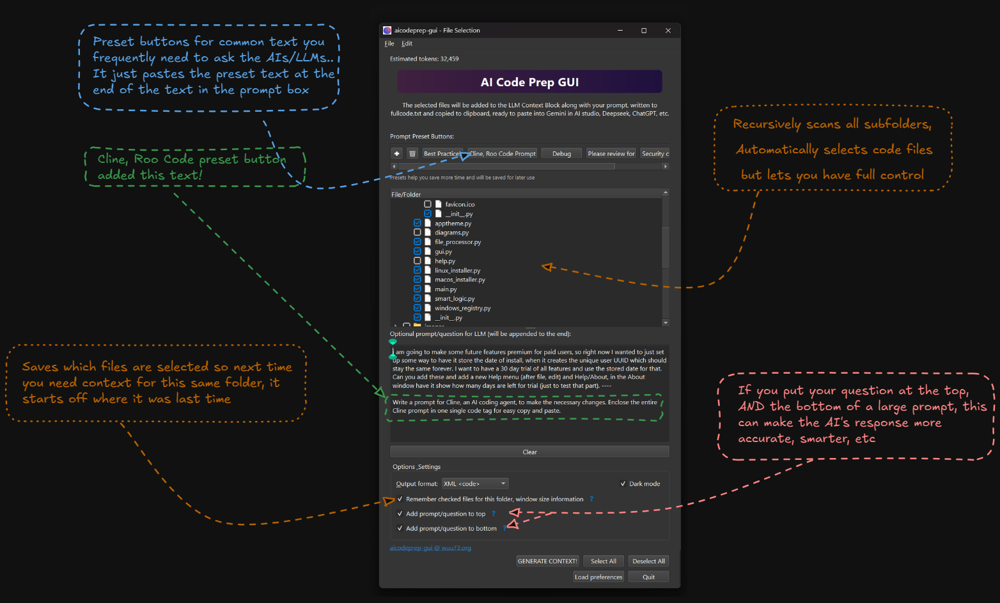

# AICodePrep GUI

AICodePrep GUI turns selected project files into one clean context block you can paste into an AI chat.

It solves a simple annoyance: when a bug or design question spans many files, copying those files into ChatGPT, Claude, Gemini, OpenRouter, or another chat by hand is slow. AICodePrep scans the folder, lets you choose the files, generates one organized bundle, copies it to your clipboard, and saves it as `.aicp/context_block.md`.

[](https://badge.fury.io/py/aicodeprep-gui)
[](https://github.com/detroittommy879/aicodeprep-gui/stargazers)



See [Documentation](https://aicp.wuu73.org) (major updates to docs)

## Why Use It

- Paste one generated context block instead of copying files one by one.
- Keep control over exactly which files the model sees.
- Models very often behave smarter and have better responses when they aren't given MCP servers, tools, its the agentic stuff that dumbs them down - using this allows full intelligence
- Use frontier models on their native web chat interface to save money (many are still free to use, like Gemini 3.5 Flash on aistudio)
- Use the same context in several AI chats and compare answers.
- Work beside any editor: VS Code, Cursor, Windsurf, PyCharm, Zed, terminals, or anything else.
- Use direct chat models for diagnosis, planning, and review before handing changes to an editor or agent.

## Install

The usual install command is:

```bash
uv tool install aicodeprep-gui
```

`pipx` also works:

```bash
pipx install aicodeprep-gui
```

(just make sure you choose one install method and stick to it)

The package supports Python 3.9 through 3.13.

If you are looking for the lazy method where you don't need to worry about python versions, this script should work (it shows you a menu before it does anything, where you can select aicodeprep-gui) [Get computer ready for vibe coding](https://wuu73.org/vibe)

## Launch

Open the current folder:

```bash
aicp
```

Open another folder:

```bash
aicp path/to/project
```

The longer command also works:

```bash
aicodeprep-gui
```

## Core Workflow

1. Open a project with `aicp` or the right-click folder integration.
2. Review the selected files.
3. Check or uncheck anything you want to change.
4. Add a prompt or use a saved preset.
5. Click **Generate Context**.
6. Paste the generated context into your AI chat.

The generated file is also saved here:

```text
.aicp/context_block.md
```

## Performance

Recent builds can use a bundled Rust worker for faster folder scanning and context generation. If the worker is unavailable for any reason, the app falls back to the Python implementation.

When launched from a terminal, the app logs whether it used Rust acceleration or Python fallback.

## Right-Click Integration

The app can install file explorer integration from its menu.

- Windows: open from File Explorer
- macOS: open from Finder
- Linux: open from supported file managers

This is optional, but it makes the app feel more like a normal desktop tool: right-click a folder, open AICodePrep, generate context.

## Configuration

You can customize scanning with an `aicodeprep-gui.toml` file in your project root.

Example:

```toml
max_file_size = 2000000

code_extensions = [".py", ".js", ".ts", ".html", ".css", ".rs"]

exclude_patterns = [
    "build/",
    "dist/",
    "*.log",
    "node_modules/",
    ".venv/"
]

default_include_patterns = [
    "README.md",
    "main.py",
    "src/**/*.py"
]
```

## Command-Line Options

```bash
# Run in the current directory
aicp

# Run in a specific directory
aicp /path/to/project

# Generate context without opening the GUI
aicp --skipui

# See all options
aicp --help
```

## Docs

The MkDocs documentation is in `docs/`.

Build it locally with:

```bash
uv run --with-requirements requirements-docs.txt mkdocs build --strict
```

Serve it locally with:

```bash
uv run --with-requirements requirements-docs.txt mkdocs serve
```

See [Documentation](https://aicp.wuu73.org) (major updates to docs)

## Pro

The free app covers the main workflow: select files, generate context, copy to clipboard, and paste into AI chats.

Pro features are optional extras for heavier use, such as dual prompt placement, syntax highlighting in the preview window, and additional workflow tools.

## Contributing

Bug reports, feature requests, and pull requests are welcome.

GitHub: https://github.com/detroittommy879/aicodeprep-gui

## Support

If the app saves you time, Pro activation and sponsorships help keep development going.

Website: https://wuu73.org/hello.html

## License

This software uses the Sustainable License.

- Free for personal and commercial use
- You may use app output commercially
- You may keep and modify source code
- You may not sell or redistribute this software
- You may not offer this as a hosted service

See [SUSTAINABLE-LICENSE](SUSTAINABLE-LICENSE).
